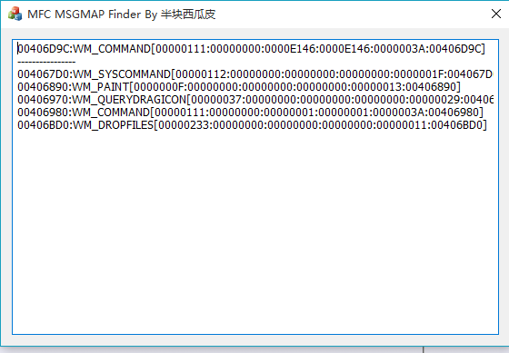

#调试MFC程序的时候，每次都要去找MESSAGE_MAP，所以写个程序自动去找

MESSAGE_MAP大概长这样

```c
BEGIN_MESSAGE_MAP(CMFChelloDlg, CDialogEx)
  ON_WM_SYSCOMMAND()
  ON_WM_PAINT()
  ON_WM_QUERYDRAGICON()
  ON_BN_CLICKED(IDOK, &CMFChelloDlg::OnBnClickedOk)
  ON_WM_DROPFILES()
END_MESSAGE_MAP()
```

实际上每个都是一个AFX_MSGMAP_ENTRY结构

```c
struct AFX_MSGMAP_ENTRY
{
  UINT nMessage;   // windows message
  UINT nCode;      // control code or WM_NOTIFY code
  UINT nID;        // control ID (or 0 for windows messages)
  UINT nLastID;    // used for entries specifying a range of control id's
  UINT_PTR nSig;       // signature type (action) or pointer to message #
  AFX_PMSG pfn;    // routine to call (or special value)
};
```

其中pfn是真正的消息处理函数，通过观察这个结构由以下特征

1. nMessage在{0,1024}的范围内

2. nCode似乎一直都是0

3. nSig是对pfn函数参数的sign，不同版本MFC也不同，范围大概在{0,100}

4. pfn肯定要位于代码段


还有一个特征是AFX_MSGMAP_ENTRY肯定位于rdata段。

通过以上限定，来静态抓取信息

